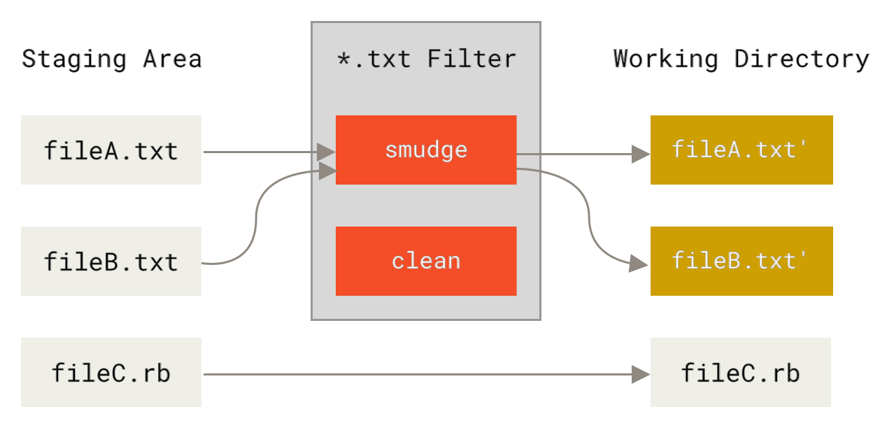

<!-- truncate -->

## Git Filters

Git offers a mechanism to split [Staging and Working](https://git-scm.com/about/staging-area) states of our files, and filters provide deterministic conversion between the two. A `smudge` filter converts files from staging to working (read: useful) state, while `clean` should “clean” files back into pristine repo storage state.

<figure>
<div class="columns-2">




</div>
<figcaption>
    Source: https://git-scm.com/book/ms/v2/Customizing-Git-Git-Attributes
</figcaption>
</figure>

In technical terms, filters can be any command into which file content can be piped. Filters are defined in git config, invoked for matching files in `.gitattributes`

 As a simple example from the [git manual](https://git-scm.com/book/ms/v2/Customizing-Git-Git-Attributes), we could set a global filter called **indent** and invoke it on `*.c` files:

```shell
git config --global filter.indent.smudge cat
git config --global filter.indent.clean indent
```

```shell title=".gitattributes"
*.c filter=indent
```

Now, all our C files are piped through `cat` on checkout (unchanged) and auto-indented on commit.

:::tip
Another common example is LFS, which uses `smudge` and `clean` to convert LFS pointer files to/from their rejuvenated state (more details [here](https://github.com/git-lfs/git-lfs/blob/main/docs/extensions.md#smudge))
:::

## Diving into Git-Crypt

Git-crypt uses filters for its transparent encryption magic: staged encrypted files and decrypted working directory. Lets take a look at a simple repo with git-crypt set up as per [instructions](https://github.com/AGWA/git-crypt?tab=readme-ov-file#using-git-crypt):

```bash
# .git/config
...

[filter "git-crypt"]
    smudge = \"git-crypt\" smudge
    clean = \"git-crypt\" clean
    required = true
[diff "git-crypt"]
    textconv = \"git-crypt\" diff
```

When unlocked, git-crypt adds filters `git-crypt smudge` and `git-crypt clean`, and stores the encryption key under `.git/git-crypt/keys/`.

Lets replicate this behavior with git-crypt locked - we will need it for rewriting history manually

```bash
export KEY=/tmp/git-crypt.key
git-crypt export-key $KEY
git-crypt lock
```

Now, the `git-crypt` filter definition is gone, and files are no longer decrypted:

```bash
git config -l | grep git-crypt
	# Empty - no filters
bat text/test-text-file_small.txt
	[bat warning]: Binary content from file 'text/test-text-file_small.txt' will not be printed to the terminal
```

But we can still decrypt it manually using the smudge filter:

```bash
git-crypt smudge --key-file $KEY < text/test-text-file_small.txt
		Lorem ipsum dolor sit amet, consectetur adipiscing elit...
```

Nice! Now, we can decrypt all the git-crypt files manually:

```bash
git ls-files | xargs git check-attr filter | grep "filter: git-crypt" | \
	cut -f 1 -d ":" | \
	xargs -I {} sh -c "git-crypt smudge --key-file $KEY < {} | sponge {}"
```

Encryption works exactly the same way, we just replace `git-crypt clean` instead of `git-crypt smudge`. Also, we technically didn’t need to isolate specifically encrypted files like we did - git-crypt is smart enough to pass through any file it doesn’t manage.

Now we have the tool to manually decrypt/encrypt all files in a working state!

## Retroactive Encryption

Lets take an unencrypted repository and rewrite history as if it always was encrypted using git-crypt starting from an arbitrary point in history. We do so in two steps: manually insert changes to `.gitattributes` into our history, and then run our manual encryption command on ALL commits using `git filter-branch`.

We will use a simple test repo as an example:

```bash
git clone https://github.com/SpaghettiPunch/git-test-files
```

Init git-crypt as usual, and save the key:

```bash
git-crypt init
git-crypt export-key $KEY
git-crypt status
		not encrypted: .gitignore
		not encrypted: README.md
		not encrypted: csv/.keep
		not encrypted: images/.keep
		not encrypted: images/test-image-png_128x128.png
		not encrypted: images/test-image-png_12x12.png
		not encrypted: images/test-image-png_1x1.png
		not encrypted: images/test-image-png_4032x3024.png
		not encrypted: pdf/.keep
		not encrypted: pdf/test-pdf-file_100_paragraphs.pdf
		not encrypted: pdf/test-pdf-file_empty.pdf
		not encrypted: text/.keep
		not encrypted: text/test-text-file_100_paragraphs.txt
		not encrypted: text/test-text-file_empty.txt
		not encrypted: text/test-text-file_new.txt
		not encrypted: text/test-text-file_small.txt
```

Now we edit our history to reflect our desired git-crypt attribute setup (in this simple case, only in the root commit):

```bash
git rebase -i --root
---
    edit 67ff5a7 Initial commit
    pick efcf199 Ignore swap files and DS_Store
    pick ee6c681 Fix naming
    pick 3e942b9 Update README
    pick 9d0e84d Remove DS_Store
    pick 4b5d933 Add a new text file
    pick 2d9b4cd Edit the new text file

    # Rebase 2d9b4cd onto f3032bb (7 commands)
---
		Stopped at 67ff5a7...  Initial commit
```

Add git-crypt filters for our desired files at this point in history:

```bash
# .gitattributes
*.txt filter=git-crypt diff=git-crypt
```

Note that git-crypt filters automatically pick up and modify the `*.txt` files now:

```bash
git-crypt status text/
		not encrypted: text/.DS_Store
		not encrypted: text/.keep
		    encrypted: text/test-text-file_100paragraphs.txt *** WARNING: staged/committed version is NOT ENCRYPTED! ***
		    encrypted: text/test-text-file_empty.txt *** WARNING: staged/committed version is NOT ENCRYPTED! ***
		    encrypted: text/test-text-file_small.txt *** WARNING: staged/committed version is NOT ENCRYPTED! ***
		
		Warning: one or more files is marked for encryption via .gitattributes but
		was staged and/or committed before the .gitattributes file was in effect.
		Run 'git-crypt status' with the '-f' option to stage an encrypted version.
		
git status
		interactive rebase in progress; onto 17c8c58
		Changes not staged for commit:
		        modified:   text/test-text-file_100paragraphs.txt
		        modified:   text/test-text-file_small.txt
		
		Untracked files:
		        .gitattributes
```

If we commit these files, they would be encrypted in the current commit, **but `*.txt` files in future commits will be left untouched**, since the clean filter never runs. Instead, we want to manually encrypt them ourselves in every commit.

Lock git-crypt to stop this behavior:

```bash
git-crypt lock -f
git status
		interactive rebase in progress; onto 17c8c58
		Untracked files:
		        .gitattributes

# Confirm our files are still unencrypted		        
cat text/test-text-file_small.txt
		Lorem ipsum dolor sit amet, consectetur adipiscing elit...

git add .	&& git commit --amend --noedit
git rebase --continue
```

Feel free to continue editing historic `.gitattribute` state as desired.

When we’re content with our history and are back at our branch tip, we can manually encrypt the adequate files in each commit using our external key as discussed in the [earlier section](https://www.notion.so/Rewriting-Git-History-with-Git-Crypt-20088e085942801db67ccd1bb6df9667?pvs=21):

```bash
GIT_LFS_SKIP_SMUDGE=1 \
FILTER_BRANCH_SQUELCH_WARNING=1 \
git filter-branch --tree-filter \
	'git ls-files | xargs git check-attr filter | grep "filter: git-crypt" | \
		cut -f 1 -d ":" | \
		xargs -I {} sh -c "git-crypt clean --key-file $KEY < {} | sponge {}" && \
		git clean -fqX' \
	--prune-empty -- --all
```

We are forced to use the [slower](https://git-scm.com/docs/git-filter-branch) `--tree-filter` instead of `--index-filter`, since we need to operate on the checked out working directory.  Note that we also need to add a `git clean` for the rewrite to [respect our `.gitignore` files](https://stackoverflow.com/questions/61916275/filter-branch-tree-filter-with-gitignore). 

`GIT_LFS_SKIP_SMUDGE=1` is an optimization to further speed up checkout (we can’t use LFS and git-crypt together anyway [at the moment](https://github.com/AGWA/git-crypt/issues/93)).

That’s it! We can use git-crypt as if it was enabled all along:

```bash
git-crypt status text/
		not encrypted: text/.keep
		    encrypted: text/test-text-file_100_paragraphs.txt
		    encrypted: text/test-text-file_empty.txt
		    encrypted: text/test-text-file_new.txt
		    encrypted: text/test-text-file_small.txt
bat text/test-text-file_small.txt
		[bat warning]: Binary content from file 'text/test-text-file_small.txt' will not be printed to the terminal
git-crypt unlock /tmp/git-crypt-test.key
cat text/test-text-file_small.txt
		Lorem ipsum dolor sit amet, consectetur adipiscing elit. Sed gravida felis...
git show
		diff --git a/text/test-text-file_new.txt b/text/test-text-file_new.txt
		index c611cb4..172d1bd 100644
		--- a/text/test-text-file_new.txt
		+++ b/text/test-text-file_new.txt
		@@ -1 +1,3 @@
		 A new file added in a new commit
		+
		+This is an edit in a later commit
```

## Retroactive Decryption

Now, lets undo all that work. We start with a repository that has been historically encrypted and want to remove all trace of git-crypt. To do this, we reverse the order of operations from [encryption](https://www.notion.so/Rewriting-Git-History-with-Git-Crypt-20088e085942801db67ccd1bb6df9667?pvs=21): we decrypt all the files in all commits using git attribute matching first, and then clean up the attributes themselves.

We begin with the git-crypt enabled and unlocked repo from the previous section.

Once again, we need to lock git-crypt to stop it from affecting our files and make sure our key is available outside the repo:

```bash
git-crypt export-key $KEY
git-crypt lock
```

We decrypt all the matching files in each commit. We don’t clean up `.gitattributes` just yet, since we use it to identify the encrypted files.

```bash
GIT_LFS_SKIP_SMUDGE=1 \
FILTER_BRANCH_SQUELCH_WARNING=1 \
git filter-branch --tree-filter \
	'git ls-files | xargs git check-attr filter | grep "filter: git-crypt" | \
		cut -f 1 -d ":" | \
		xargs -I {} sh -c "git-crypt smudge --key-file $KEY < {} | sponge {}" && \
		git clean -fqX' \
	--prune-empty -- --all
```

*This is the same command as in the encryption case, but `smudge` instead of `clean`*

Now that all the files are decrypted, we can clean up `.gitattributes` in a new rewrite. In each commit, we clean up any git-crypt filter lines in the file if it exists. We also delete the file if that was the only line.

```bash
git filter-branch --tree-filter \
	'([ -e .gitattributes ] && sed -i "/filter=git-crypt/d" .gitattributes || true) && \
	 ([ -e .gitattributes ] && [ ! -s .gitattributes ] && rm .gitattributes || true) && \
	 git clean -fqX' \
	--prune-empty -- --all
```

Don’t forget to clean up:

```bash
rm -r .git/git-crypt
rm $KEY
```

Our repo history is free of encrypted files and git-crypt settings again!

```bash
git show
		diff --git a/text/test-text-file_new.txt b/text/test-text-file_new.txt
		index c611cb4..172d1bd 100644
		--- a/text/test-text-file_new.txt
		+++ b/text/test-text-file_new.txt
		@@ -1 +1,3 @@
		 A new file added in a new commit
		+
		+This is an edit in a later commit
git-crypt status text/
		not encrypted: text/.keep
		not encrypted: text/test-text-file_100_paragraphs.txt
		not encrypted: text/test-text-file_empty.txt
		not encrypted: text/test-text-file_new.txt
		not encrypted: text/test-text-file_small.txt
```