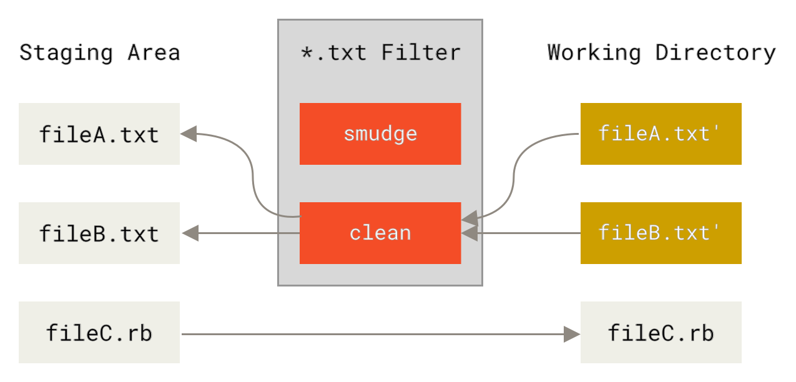

import Tabs from '@theme/Tabs';
import TabItem from '@theme/TabItem';


[Git-crypt](https://github.com/AGWA/git-crypt) is an incredible tool for convenient set-up-and-forget secrets in your repository. But what if you didn't consider it at your repo's conception? Or conversely, what if you reached a point when need to clean your repository of git-crypt?

<!-- truncate -->

Despite abundant vocal purist git proponents of "never rewriting published git history", there are [some good reasons](https://drewdeponte.com/blog/when-to-rewrite-git-history/) to do so. Moreover, this conundrum [has](https://github.com/AGWA/git-crypt/issues/36#issuecomment-73580393) [quite](https://github.com/AGWA/git-crypt/issues/7) a [bit](https://github.com/AGWA/git-crypt/issues/132) of [demand](https://github.com/AGWA/git-crypt/issues/137) for a good approach.

A notable mechanism offered by a predecessor in this search is [using patch files](https://gist.github.com/marcopaganini/62fc51a679f8985c10c3ca5d0c84031c), but my case ran into encoding issues.

If you are in the same boat, and have a good enough reason to seek a way to either a) convert a cleantext repository into a state equivalent to having started it with git-crypt the whole time or b) completely erase the effects of git-crypt on repository history, read on!

<details>
<summary>If you're in a hurry, here's a TL;DR!</summary>

<Tabs>
  <TabItem value="encrypt" label="Encrypt a Cleantext Repo" default>
```shell
# terminal-command
export KEY=/tmp/git-crypt.key
# terminal-command
git-crypt init
# terminal-command
git-crypt export-key $KEY
# terminal-command
git-crypt lock
# Insert git-crypt filter into .gitattributes where desired in past commit(s)
# eg, using git rebase -i
# Then, back at the tip of the branch
# terminal-command
GIT_LFS_SKIP_SMUDGE=1 \
# terminal-command-multiline
FILTER_BRANCH_SQUELCH_WARNING=1 \
# terminal-command-multiline
git filter-branch --tree-filter \
# terminal-command-multiline
  'git ls-files | xargs git check-attr filter | \
# terminal-command-multiline
   grep "filter: git-crypt" | cut -f 1 -d ":" | \
# terminal-command-multiline
   xargs -I {} sh -c "git-crypt clean --key-file $KEY < {} | sponge {}" && \
# terminal-command-multiline
   git clean -fqX' \
# terminal-command-multiline
  --prune-empty -- --all
```
  </TabItem>
  <TabItem value="decrypt" label="Decrypt an Encrypted Repo">
```shell
# terminal-command
export KEY=/tmp/git-crypt.key
# terminal-command
git-crypt export-key $KEY
# terminal-command
git-crypt lock
# terminal-command
GIT_LFS_SKIP_SMUDGE=1 \
# terminal-command-multiline
FILTER_BRANCH_SQUELCH_WARNING=1 \
# terminal-command-multiline
git filter-branch --tree-filter \
# terminal-command-multiline
  'git ls-files | xargs git check-attr filter | \
# terminal-command-multiline
   grep "filter: git-crypt" | cut -f 1 -d ":" | \
# terminal-command-multiline
   xargs -I {} sh -c "git-crypt smudge --key-file $KEY < {} | sponge {}" && \
# terminal-command-multiline
   git clean -fqX' \
# terminal-command-multiline
   --prune-empty -- --all
# terminal-command
GIT_LFS_SKIP_SMUDGE=1 \
# terminal-command-multiline
FILTER_BRANCH_SQUELCH_WARNING=1 \
# terminal-command-multiline
git filter-branch --tree-filter \
# terminal-command-multiline
  '([ -e .gitattributes ] && sed -i "/filter=git-crypt/d" .gitattributes || true) && \
# terminal-command-multiline
   ([ -e .gitattributes ] && [ ! -s .gitattributes ] && rm .gitattributes || true) && \
# terminal-command-multiline
   git clean -fqX' \
# terminal-command-multiline
   --prune-empty -- --all
```
  </TabItem>
</Tabs>
</details>


:::warning
This process will affect every commit in your repository, change ref hashes, and otherwise participates in all the dangers of manually rewriting git history.

**_Make backups!  Septuple check before the force push!_**
:::

## Some Git Background: Filters

Git offers a mechanism to split [Staging and Working](https://git-scm.com/about/staging-area) states of our files, and filters provide deterministic conversion between the two. A `smudge` filter converts files from staging to working (read: useful) state, while `clean` should “clean” files back into pristine repo storage state.

<figure>
<div class="columns-2">




</div>
<figcaption>
    Source: https://git-scm.com/book/ms/v2/Customizing-Git-Git-Attributes
</figcaption>
</figure>

In technical terms, filters can be any command into which file content can be piped. Filters are defined in git config and invoked for matching files in `.gitattributes`.

As a simple example from the [git manual](https://git-scm.com/book/ms/v2/Customizing-Git-Git-Attributes), we could set a global filter called **indent** and invoke it on `*.c` files:

```shell
# terminal-command
git config --global filter.indent.smudge cat
# terminal-command
git config --global filter.indent.clean indent
```

```shell title=".gitattributes"
*.c filter=indent
```

Now, all our C files are piped through `cat` on checkout (unchanged) and auto-indented on commit.

:::tip
Another common example is LFS, which uses `smudge` and `clean` to convert LFS pointer files to/from their rejuvenated state (more details [here](https://github.com/git-lfs/git-lfs/blob/main/docs/extensions.md#smudge))
:::

## Diving into Git-Crypt

Git-crypt uses filters for its transparent encryption magic: staged encrypted files and decrypted working directory. Lets take a look at a simple repo with git-crypt set up as per [instructions](https://github.com/AGWA/git-crypt?tab=readme-ov-file#using-git-crypt):

```ini title=".git/config"
...
[filter "git-crypt"]
    smudge = \"git-crypt\" smudge
    clean = \"git-crypt\" clean
    required = true
[diff "git-crypt"]
    textconv = \"git-crypt\" diff
```

When unlocked, git-crypt adds filters `git-crypt smudge` and `git-crypt clean`, and stores the encryption key under `.git/git-crypt/keys/`.

Lets replicate this behavior with git-crypt locked - we will need it for rewriting history manually

```shell
# terminal-command
export KEY=/tmp/git-crypt.key
# terminal-command
git-crypt export-key $KEY
# terminal-command
git-crypt lock
```

Now, the `git-crypt` filter definition is gone, and files are no longer decrypted:

```shell
# terminal-command
git config -l | grep git-crypt
# Empty - no filters
# terminal-command
bat text/test-text-file_small.txt
[bat warning]: Binary content from file 'text/test-text-file_small.txt' will not be printed to the terminal ```
```

But we can still decrypt it by manually invoking the smudge filter:

```shell
# terminal-command
git-crypt smudge --key-file $KEY < text/test-text-file_small.txt
Lorem ipsum dolor sit amet, consectetur adipiscing elit...
```

_Note that we needed to supply our key manually - by default the filter looks for them under `.git/git-crypt/keys/`, but `git-crypt lock` cleaned them up._

Nice! Now, we can decrypt the git-crypt files in-place all at once by matching them against the git attributes:

```shell
# terminal-command
git ls-files | xargs git check-attr filter | \
# terminal-command-multiline
  grep "filter: git-crypt" | cut -f 1 -d ":" | \
# terminal-command-multiline
  xargs -I {} sh -c "git-crypt smudge --key-file $KEY < {} | sponge {}"
```

Encryption works exactly the same way, we just use `git-crypt clean` instead of `git-crypt smudge`. Also, we technically didn’t need to isolate specifically encrypted files like we did - git-crypt is smart enough to pass through any file it doesn’t manage. But this way is cleaner, more complete, and should be a minor optimization for big repositories.

Now we have the tool to manually decrypt/encrypt all files in a given working directory state!

## Retroactive Encryption

Lets take an unencrypted repository and rewrite history as if it always was encrypted using git-crypt starting from an arbitrary point in history. We do so in two steps: manually insert changes to `.gitattributes` into our history, and then run our manual encryption command on ALL commits using `git filter-branch`.

We will use a simple test repo as an example:

```shell
# terminal-command
git clone https://github.com/SpaghettiPunch/git-test-files
```

Init git-crypt as usual, and save the key:

```shell
# terminal-command
export KEY=/tmp/git-crypt.key
# terminal-command
git-crypt init
# terminal-command
git-crypt export-key $KEY
# terminal-command
git-crypt status
    not encrypted: .gitignore
    not encrypted: README.md
    not encrypted: csv/.keep
    not encrypted: images/.keep
    not encrypted: images/test-image-png_128x128.png
    not encrypted: images/test-image-png_12x12.png
    not encrypted: images/test-image-png_1x1.png
    not encrypted: images/test-image-png_4032x3024.png
    not encrypted: pdf/.keep
    not encrypted: pdf/test-pdf-file_100_paragraphs.pdf
    not encrypted: pdf/test-pdf-file_empty.pdf
    not encrypted: text/.keep
    not encrypted: text/test-text-file_100_paragraphs.txt
    not encrypted: text/test-text-file_empty.txt
    not encrypted: text/test-text-file_new.txt
    not encrypted: text/test-text-file_small.txt
```

Now we edit our history to reflect our desired git-crypt attribute setup (in this simple case, only in the root commit):

```shell
# terminal-command
git rebase -i --root
---
    edit 67ff5a7 Initial commit
    pick efcf199 Ignore swap files and DS_Store
    pick ee6c681 Fix naming
    pick 3e942b9 Update README
    pick 9d0e84d Remove DS_Store
    pick 4b5d933 Add a new text file
    pick 2d9b4cd Edit the new text file

    # Rebase 2d9b4cd onto f3032bb (7 commands)
---
    Stopped at 67ff5a7...  Initial commit
```

Add git-crypt filters for our desired files at this point in history:

```shell title=".gitattributes"
*.txt filter=git-crypt diff=git-crypt
```

Note that git-crypt filters automatically pick up and modify the `*.txt` files now:

```shell
# terminal-command
git-crypt status text/
    not encrypted: text/.DS_Store
    not encrypted: text/.keep
        encrypted: text/test-text-file_100paragraphs.txt *** WARNING: staged/committed version is NOT ENCRYPTED! ***
        encrypted: text/test-text-file_empty.txt *** WARNING: staged/committed version is NOT ENCRYPTED! ***
        encrypted: text/test-text-file_small.txt *** WARNING: staged/committed version is NOT ENCRYPTED! ***
    
    Warning: one or more files is marked for encryption via .gitattributes but
    was staged and/or committed before the .gitattributes file was in effect.
    Run 'git-crypt status' with the '-f' option to stage an encrypted version.
		
# terminal-command
git status
    interactive rebase in progress; onto 17c8c58
    Changes not staged for commit:
        modified:   text/test-text-file_100paragraphs.txt
        modified:   text/test-text-file_small.txt

    Untracked files:
        .gitattributes
```

If we commit these files, they would be encrypted in the current commit, **but `*.txt` files in future commits will be left untouched**, since the clean filter never runs. Instead, we want to manually encrypt them ourselves in every commit.

Lock git-crypt to stop this behavior:

```shell
# terminal-command
git-crypt lock -f
# terminal-command
git status
    interactive rebase in progress; onto 17c8c58
    Untracked files:
            .gitattributes

# Confirm our files are still unencrypted		        
# terminal-command
cat text/test-text-file_small.txt
Lorem ipsum dolor sit amet, consectetur adipiscing elit...

# terminal-command
git add . && git commit --amend --noedit
# terminal-command
git rebase --continue
```

Feel free to continue editing historic `.gitattribute` state as desired.

When we’re content with our history and are back at our branch tip, we can manually encrypt the adequate files in each commit using our external key as discussed in the [earlier section](#diving-into-git-crypt):

```shell
# terminal-command
GIT_LFS_SKIP_SMUDGE=1 \
# terminal-command-multiline
FILTER_BRANCH_SQUELCH_WARNING=1 \
# terminal-command-multiline
git filter-branch --tree-filter \
# terminal-command-multiline
	'git ls-files | xargs git check-attr filter | \
# terminal-command-multiline
	 grep "filter: git-crypt" | cut -f 1 -d ":" | \
# terminal-command-multiline
	 xargs -I {} sh -c "git-crypt clean --key-file $KEY < {} | sponge {}" && \
# terminal-command-multiline
	 git clean -fqX' \
# terminal-command-multiline
	--prune-empty -- --all
```

We are forced to use the [slower](https://git-scm.com/docs/git-filter-branch) `--tree-filter` instead of `--index-filter`, since we need to operate on the checked out working directory.  Note that we also need to add a `git clean` for the rewrite to [respect our `.gitignore` files](https://stackoverflow.com/questions/61916275/filter-branch-tree-filter-with-gitignore). 

`GIT_LFS_SKIP_SMUDGE=1` is an optimization to further speed up checkout (we can’t use LFS and git-crypt together anyway [at the moment](https://github.com/AGWA/git-crypt/issues/93)).

That’s it! We can use git-crypt as if it was enabled all along:

```shell
# terminal-command
git-crypt status text/
    not encrypted: text/.keep
        encrypted: text/test-text-file_100_paragraphs.txt
        encrypted: text/test-text-file_empty.txt
        encrypted: text/test-text-file_new.txt
        encrypted: text/test-text-file_small.txt
# terminal-command
bat text/test-text-file_small.txt
    [bat warning]: Binary content from file 'text/test-text-file_small.txt' will not be printed to the terminal
# terminal-command
git-crypt unlock $KEY
# terminal-command
cat text/test-text-file_small.txt
Lorem ipsum dolor sit amet, consectetur adipiscing elit...
# terminal-command
git show
    diff --git a/text/test-text-file_new.txt b/text/test-text-file_new.txt
    index c611cb4..172d1bd 100644
    --- a/text/test-text-file_new.txt
    +++ b/text/test-text-file_new.txt
    @@ -1 +1,3 @@
     A new file added in a new commit
    +
    +This is an edit in a later commit
```

Note that using this method git-crypt also picked up the new file (`text/test-text-file_new.txt`), which was added at a commit after the root, as we desired

## Retroactive Decryption

Now, lets undo all that work. We start with a repository that has been historically encrypted and want to remove all trace of git-crypt. To do this, we reverse the order of operations from [encryption](#retroactive-encryption): we decrypt all the files in all commits using git attribute matching first, and then clean up the attributes themselves.

We begin with the git-crypt enabled and unlocked repo from the previous section.

Once again, we need to lock git-crypt to stop it from affecting our files and make sure our key is available outside the repo:

```shell
# terminal-command
git-crypt export-key $KEY
# terminal-command
git-crypt lock
```

We can manually decrypt all the matching files in each commit now. We don’t clean up `.gitattributes` just yet, since we use it to identify the encrypted files.

```shell
# terminal-command
GIT_LFS_SKIP_SMUDGE=1 \
# terminal-command-multiline
FILTER_BRANCH_SQUELCH_WARNING=1 \
# terminal-command-multiline
git filter-branch --tree-filter \
# terminal-command-multiline
  'git ls-files | xargs git check-attr filter | \
# terminal-command-multiline
   grep "filter: git-crypt" | cut -f 1 -d ":" | \
# terminal-command-multiline
   xargs -I {} sh -c "git-crypt smudge --key-file $KEY < {} | sponge {}" && \
# terminal-command-multiline
   git clean -fqX' \
# terminal-command-multiline
   --prune-empty -- --all
```
*This is the same command as in the encryption case, but `smudge` instead of `clean`*

Now that all the files are decrypted, we can clean up `.gitattributes` in a new rewrite. In each commit, we clean up any git-crypt filter lines in the file if it exists, and can also delete the file if that was the only line, leaving it empty:

```shell
# terminal-command
GIT_LFS_SKIP_SMUDGE=1 \
# terminal-command-multiline
FILTER_BRANCH_SQUELCH_WARNING=1 \
# terminal-command-multiline
git filter-branch --tree-filter \
# terminal-command-multiline
  '([ -e .gitattributes ] && sed -i "/filter=git-crypt/d" .gitattributes || true) && \
# terminal-command-multiline
   ([ -e .gitattributes ] && [ ! -s .gitattributes ] && rm .gitattributes || true) && \
# terminal-command-multiline
   git clean -fqX' \
# terminal-command-multiline
   --prune-empty -- --all
```

Don’t forget to clean up:

```shell
# terminal-command
rm -r .git/git-crypt
# terminal-command
rm $KEY
```

Our repo history is free of encrypted files and git-crypt settings again!

```shell
# terminal-command
git show
    diff --git a/text/test-text-file_new.txt b/text/test-text-file_new.txt
    index c611cb4..172d1bd 100644
    --- a/text/test-text-file_new.txt
    +++ b/text/test-text-file_new.txt
    @@ -1 +1,3 @@
        A new file added in a new commit
    +
    +This is an edit in a later commit
# terminal-command
git-crypt status text/
    not encrypted: text/.keep
    not encrypted: text/test-text-file_100_paragraphs.txt
    not encrypted: text/test-text-file_empty.txt
    not encrypted: text/test-text-file_new.txt
    not encrypted: text/test-text-file_small.txt
```

---
